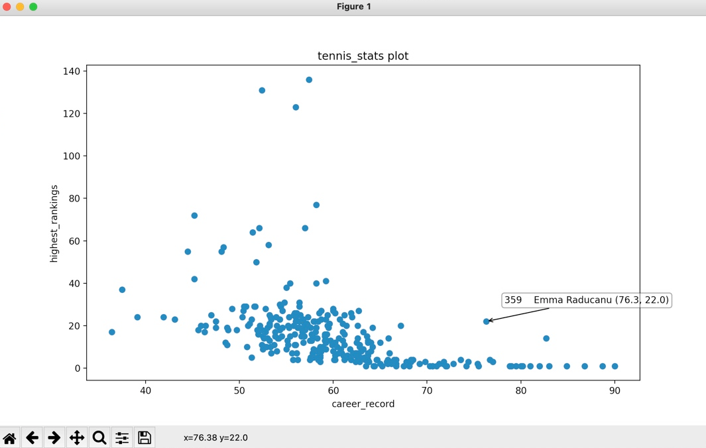
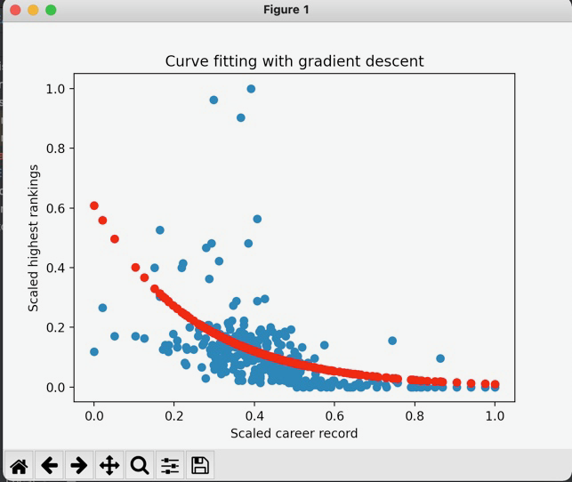
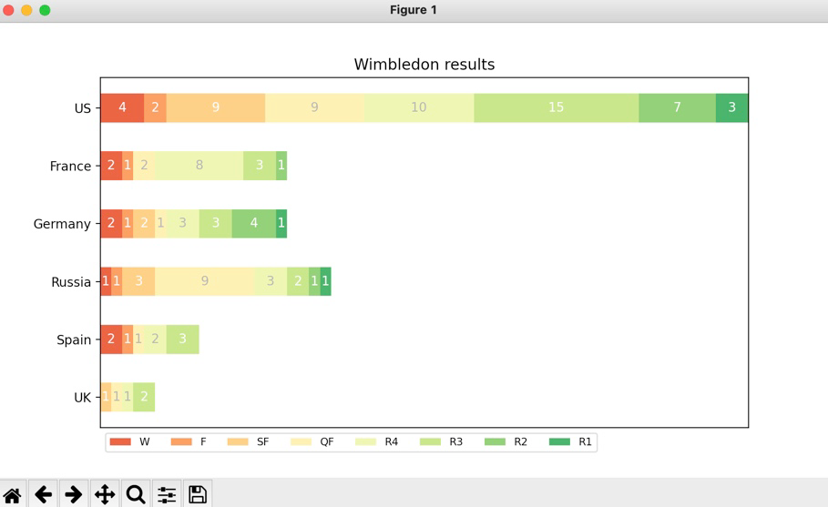
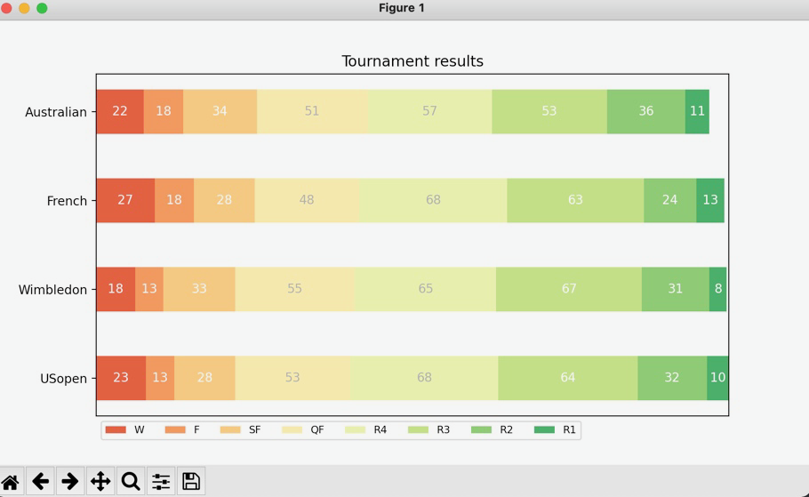

# Welcome to tennis_stats!

This is a collection of CLI tools to scrape and analyse tennis players 
player statistics as can be found on wikipedia.

## Intro

There are two main use-cases for the CLI:

1. Scrape wikipedia using the command `generatedataframe` to generate a new dataframe and perform
data analysis.

2. Use a ready-made dataframe scraped from wikipedia on 22.10.2021
and perform data analysis.  The ready-made dataframe was scraped
   using the same `generatedataframe` command from our CLI.
   

### 1. Scrape wikipedia
Before scraping one must set the following parameters: 
player gender, earliest birthyear, and nationality.

The default settings for the parameters are:  female, 1950, and any.
The default earliest birth year of 1950 was chosen to maximise 
the amount of available information.
To check these default settings use the `showdefaults` command.

To alter the parameters use the following commands:

 - `playergender gender` to change the gender, where gender can
be male or female
   
 - `birthyear xyzw` where xyzw must be a numeral at least equal
to 1950.  
   
 - `nationality xyz` where xyz is one of the supported 
nationalities defined in the Nationality enum.  


After altering these parameters one can check the current settings 
with the `showsettings` command.

Once one is happy with the parameters the command `generatedataframe`
will scrape wikipedia and generate a pandas dataframe with the following columns:

Name | Birth | Nationality | wikilink | career_record | highest_rankings | Australian | French | Wimbledon | USopen

The data sources for the player Name, Birth, Nationality, and wikilinks
are these tables:

[Wikipedia list of female tennis players](https://en.wikipedia.org/wiki/List_of_female_tennis_players)

[Wikipedia list of male tennis players](https://en.wikipedia.org/wiki/List_of_male_singles_tennis_players)


The career_record, highest_rankings, Australian, French, Wimbledon,
and are taken from the infoboxes (player cards) on each player's
wikipedia entry.


### 2. Use the ready-made dataframe
The ready-made dataframes `tennis_stats/pickled-dataframes/females-final.pkl`
and `tennis_stats/pickled-dataframes/males-final.pkl` were obtained 
as described above with the default settings.

To load these dataframes use the command

```
usedefaultframe female
```
to load the female players dataframe and 

```
usedefaultframe male
```
to load the male players dataframe.

### 3. Perform data analysis

The following commands can be used once a dataframe is either
created by scraping or loaded from the pickle files.

#### View the dataframe
To view the dataframe use the `displaydataframe` command.

#### Frame methods
One can various impose filters on the dataframe.  These are
contained in the `framemethods.py` file and wrapped as CLI
commands in `main.py`.  One can add more such filters as desired.

 - `filterranking int` keeps only entries with highest_rankings
less than int
   
 - `filterrecord float` keeps only entries with career_record
at least float
   
 - `filterbirthyear int` keeps only entries with Birth at least 
int

 - `filternationality xyz` keeps only entries of supported 
nationality xyz
   
 - `selectplayer xyz` displays info of players whose Name contains 
xzy
   
 - `max career record` displays players with maximum career_record

#### Analysis
The `analysis.py` file contains some visual data analysis functions
for the dataframe wrapped as CLI commands in `main.py`.  Examples of use
on the female player default dataframe:
 - `plot career_record highest_rankings`
   


The annotations for each point consist of: idx of player in
dataframe, Name, career record and highest ranking
 - `plot career_record highest_rankings fitcurve`
   

 - `plot nationalresults Tour`


 - `plot tourresults`

